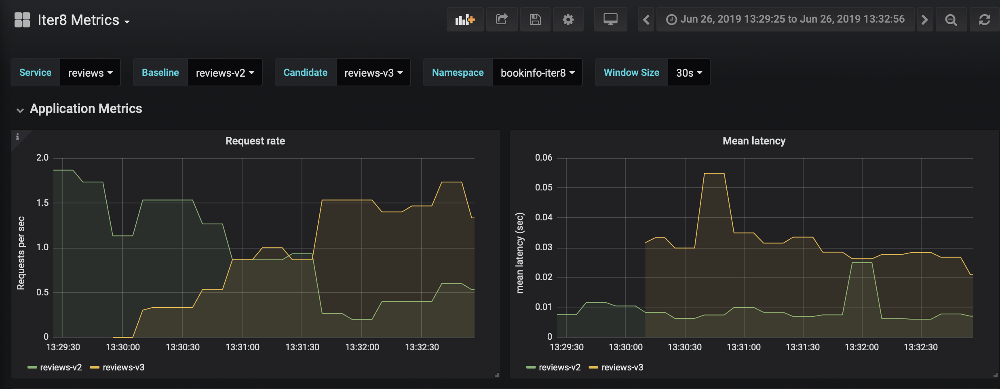
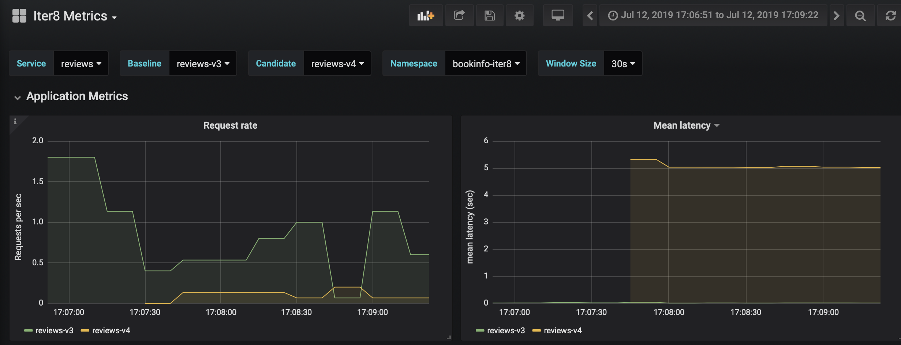

# Automated canary releases with iter8 on Kubernetes and Istio

This tutorial shows you how _iter8_ can be used to perform canary releases by gradually shifting traffic to a canary version of a microservice. In the first part of the tutorial, we will walk you through a case where the canary version performs as expected and, therefore, takes over from the previous version at the end. In the second part, we will deal with a canary version that is not satisfactory, in which case _iter8_ will roll back to the previous version.

The tutorial is based on the [Bookinfo sample application](https://istio.io/docs/examples/bookinfo/) that is distributed with Istio. This application comprises 4 microservices, namely, _productpage_, _details_, _reviews_, and _ratings_, as illustrated [here](https://istio.io/docs/examples/bookinfo/). Please, follow our instructions below to deploy the sample application as part of the tutorial.

## Part 1: Successful canary release: _reviews-v2_ to _reviews-v3_

### 1. Deploy the Bookinfo application

At this point, we assume that you have already followed the [instructions](istio_install.md) to install _iter8_ on your Kubernetes cluster. The next step is to deploy the sample application we will use for the tutorial.

First, let us create a `bookinfo-iter8` namespace configured to enable auto-injection of the Istio sidecar:

```bash
kubectl apply -f https://raw.github.ibm.com/istio-research/iter8-controller/master/doc/tutorials/istio/bookinfo/namespace.yaml?token=AAAROHqyPLzp4h4FWozSZdHNcRkz2sGCks5dE9sMwA%3D%3D
```

Next, let us deploy the Bookinfo application:

```bash
kubectl apply -n bookinfo-iter8 -f https://raw.github.ibm.com/istio-research/iter8-controller/master/doc/tutorials/istio/bookinfo/bookinfo-tutorial.yaml?token=AAAROPJZY04WTinFDpmJohfu0K28lxPFks5dE-rRwA%3D%3D
```

You should see the following pods in the `bookinfo-iter8` namespace. Make sure the pods' status is "Running." Also, note that there should be 2 containers in each pod, since the Istio sidecar was injected.

```bash
$ kubectl get pods -n bookinfo-iter8
NAME                              READY   STATUS    RESTARTS   AGE
details-v1-68c7c8666d-m78qx       2/2     Running   0          64s
productpage-v1-7979869ff9-fln6g   2/2     Running   0          63s
ratings-v1-8558d4458d-rwthl       2/2     Running   0          64s
reviews-v2-df64b6df9-ffb42        2/2     Running   0          63s
```

We have deployed "version 2" of the _reviews_ microservice, and version 1 of all others.

Let us now expose the edge _productpage_ service by creating an Istio Gateway for it.

```bash
kubectl apply -n bookinfo-iter8 -f https://raw.github.ibm.com/istio-research/iter8-controller/master/doc/tutorials/istio/bookinfo/bookinfo-gateway.yaml?token=AAAROOeOINW85InWPx9RWpYjulM23RJYks5dE-43wA%3D%3D
```

You should now see the Istio Gateway and VirtualService for _productpage_, as below:

```bash
$ kubectl get gateway -n bookinfo-iter8
NAME               AGE
bookinfo-gateway   22s
```

```bash
$ kubectl get vs -n bookinfo-iter8
NAME       GATEWAYS             HOSTS                   AGE
bookinfo   [bookinfo-gateway]   [bookinfo.sample.dev]   27s
```

As you can see above, we have associated Bookinfo's edge service with a fake host, namely, `bookinfo.sample.dev`.

### 2. Access the Bookinfo application

To access the application, you need to determine the ingress IP and port for the application in your environment. You can do so by following steps 3 and 4 of the Istio instructions [here](https://istio.io/docs/examples/bookinfo/#determining-the-ingress-ip-and-port) to set the environment variables `INGRESS_HOST`, `INGRESS_PORT`, and `GATEWAY_URL`, which will capture the correct IP address and port for your environment. Once you have done so, you can check if you can access the application with the following command:

```bash
curl -H "Host: bookinfo.sample.dev" -o /dev/null -s -w "%{http_code}\n" "http://${GATEWAY_URL}/productpage"
```

If everything is working, the command above should show `200`. Note that the curl command above sets the host header to match the host we associated the VirtualService with (`bookinfo.sample.dev`). If you want to access the application from your browser, you will need to set this header using a browser's plugin of your choice.

### 3. Generate load to the application

Let us now generate load to the application, emulating requests coming from users. To do so, we recommend you run the command below on a separate terminal:

```bash
watch -n 0.1 'curl -H "Host: bookinfo.sample.dev" -Is "$GATEWAY_URL/productpage"'
```

This command will send 10 requests per second to the application. Note that the environment variable `GATEWAY_URL` must have been set as per step 2 above. Among other things, the command output should show an HTTP code of 200, as below:

```
HTTP/1.1 200 OK
content-type: text/html; charset=utf-8
content-length: 5719
server: istio-envoy
(...)
```

### 4. Configure a canary rollout for the _reviews_ service

At this point, Bookinfo is using version 2 of the _reviews_ service (_reviews-v2_). Let us now use _iter8_ to automate the canary rollout of version 3 of this service (_reviews-v3_).

First, we need to tell _iter8_ that we are about to perform this canary rollout. To that end, we create an `Experiment` configuration specifying the rollout details. In this tutorial, let us use the following `Experiment` configuration:

```yaml
apiVersion: iter8.tools/v1alpha1
kind: Experiment
metadata:
  name: reviews-v3-rollout
spec:
  targetService:
    name: reviews
    apiVersion: v1
    baseline: reviews-v2
    candidate: reviews-v3
  trafficControl:
    strategy: check_and_increment
    interval: 30s
    trafficStepSize: 20
    maxIterations: 8
    maxTrafficPercentage: 80
  analysis:
    analyticsService: "http://iter8-analytics.iter8"
    successCriteria:
      - metricName: iter8_latency
        toleranceType: threshold
        tolerance: 0.2
        sampleSize: 5
```

The configuration above specifies the baseline and candidate versions in terms of Kubernetes deployment names. The rollout is configured to last for 8 iterations (`maxIterations`) of `30s` (`interval`). At the end of each iteration, if the candidate version meets the specified success criteria, the traffic sent to it will increase by 20 percentage points (`trafficStepSize`) up to 80% (`maxTrafficPercentage`). At the end of the last iteration, if the success criteria are met, the candidate version will take over from the baseline.

In the example above, we specified only one success criterion. In particular, we stated that the mean latency exhibited by the candidate version should not exceed the threshold of 0.2 seconds. At the end of each iteration, _iter8-controller_ calls _iter8-analytics_, which in turn analyzes the metrics of interest (in this case, only mean latency) against the corresponding criteria. The number of data points analyzed during an experiment is cumulative, that is, it carries over from iteration to iteration.

The next step of this tutorial is to actually create the configuration above. To that end, you can either copy and paste the yaml above to a file and then run `kubectl apply -n bookinfo-iter8 -f` on it, or you can run the following command:

```bash
kubectl apply -n bookinfo-iter8 -f https://raw.github.ibm.com/istio-research/iter8-controller/master/doc/tutorials/istio/bookinfo/canary_reviews-v2_to_reviews-v3.yaml?token=AAAROAp-9Astj0JUrpThGmqd_t8V-omqks5dHQ0QwA%3D%3D
```

You can verify that the `Experiment` object has been created as shown below:

```bash
$ kubectl get experiments -n bookinfo-iter8
NAME                 COMPLETED   STATUS                            BASELINE     PERCENTAGE   CANDIDATE    PERCENTAGE
reviews-v3-rollout   False       Candidate deployment is missing   reviews-v2   100          reviews-v3   0
```

As you can see, _iter8_ is reporting that 100% of the traffic is sent to the baseline version (_reviews-v2_) and that the candidate (_reviews-v3_) is missing. As soon as the controller sees the candidate version, it will start the rollout. Next, let us deploy the candidate version to trigger the canary rollout.

### 5. Deploy the canary version and start the rollout

As soon as we deploy _reviews-v3_, _iter8-controller_ will start the rollout. To deploy _reviews-v3_, you can run the following command:

```bash
kubectl apply -n bookinfo-iter8 -f https://raw.github.ibm.com/istio-research/iter8-controller/master/doc/tutorials/istio/bookinfo/reviews-v3.yaml?token=AAAROIqK9-mFXbocObzC8SISv6WLzB9Zks5dGksSwA%3D%3D
```

Now, if you check the state of the `Experiment` object corresponding to this rollout, you should see that the rollout is in progress, and that 20% of the traffic is now being sent to _reviews-v3_:

```bash
$ kubectl get experiments -n bookinfo-iter8
NAME                 COMPLETED   STATUS        BASELINE     PERCENTAGE   CANDIDATE    PERCENTAGE
reviews-v3-rollout   False       Progressing   reviews-v2   80           reviews-v3   20
```

At about every 30s you should see the traffic shift towards _reviews-v3_ by 20 percentage points.

### 6. Check the Grafana dashboard

You can also check a Grafana dashboard specific to the `Experiment` object corresponding to the rollout you are running. The URL to the Grafana dashboard for the experiment is the value of the field `grafanaURL` under the object's `status`. One way to get the Grafana URL that you can paste to your browser is through the following command:

```bash
kubectl get experiment reviews-v3-rollout -o jsonpath='{.status.grafanaURL}' -n bookinfo-iter8
```

Below is a screenshot of a portion of the Grafana dashboard showing the request rate and the mean latency for reviews-v2 and reviews-v3, right after the controller ended the experiment.



Note how the traffic shifted towards the canary during the experiment. You can also see that the canary's mean latency was way below the configured threshold of 0.2 seconds.

## Part 2: Canary release resulting in rollback: _reviews-v3_ to _reviews-v4_

At this point, you must have completed the part 1 of the tutorial successfully. You can confirm it as follows:

```bash
$ kubectl get experiment reviews-v3-rollout  -n bookinfo-iter8
NAME                 COMPLETED   STATUS   BASELINE     PERCENTAGE   CANDIDATE    PERCENTAGE
reviews-v3-rollout   True                 reviews-v2   0            reviews-v3   100
```

The command above's output shows that _reviews-v3_ took over from _reviews-v2_ as part of the canary rollout performed before.

### 1. Canary rollout configuration

Now, let us set up a canary rollout for _reviews-v4_, using the following `Experiment` configuration:

```yaml
apiVersion: iter8.tools/v1alpha1
kind: Experiment
metadata:
  name: reviews-v4-rollout
spec:
  targetService:
    name: reviews
    apiVersion: v1
    baseline: reviews-v3
    candidate: reviews-v4
  trafficControl:
    strategy: check_and_increment
    interval: 30s
    trafficStepSize: 20
    maxIterations: 6
    maxTrafficPercentage: 80
  analysis:
    analyticsService: "http://iter8-analytics.iter8"
    successCriteria:
      - metricName: iter8_latency
        toleranceType: threshold
        tolerance: 0.2
        sampleSize: 5
```

The configuration above is pretty much the same we used in part 1, except that now the baseline version is _reviews-v3_ and the candidate is _reviews-v4_.

To create the above `Experiment` object, run the following command:

```bash
kubectl apply -n bookinfo-iter8 -f https://raw.github.ibm.com/istio-research/iter8-controller/master/doc/tutorials/istio/bookinfo/canary_reviews-v3_to_reviews-v4.yaml?token=AAAROA1kB3wG0Qb_dI_gwzu9MZttTBS-ks5dHQ13wA%3D%3D
```

You can list all `Experiment` objects like so:

```bash
$ kubectl get experiments -n bookinfo-iter8
NAME                 COMPLETED   STATUS                            BASELINE     PERCENTAGE   CANDIDATE    PERCENTAGE
reviews-v3-rollout   True                                          reviews-v2   0            reviews-v3   100
reviews-v4-rollout   False       Candidate deployment is missing   reviews-v3   100          reviews-v4   0
```

The output above shows the new object you just created, for which the candidate deployment _reviews-v4_ is missing. Let us deploy _reviews-v4_ next so that the rollout can begin.

### 2. Deploy _reviews-v4_ and start the rollout

As you have already seen, as soon as we deploy the candidate version, _iter8-controller_ will start the rollout. This time, however, the candidate version (_reviews-v4_) has a performance issue preventing it from satisfying the success criteria in the experiment object. As a result, _iter8_ will roll back to the baseline version.

To deploy _reviews-v4_, run the following command:

```bash
kubectl apply -n bookinfo-iter8 -f https://raw.github.ibm.com/istio-research/iter8-controller/master/doc/tutorials/istio/bookinfo/reviews-v4.yaml?token=AAARODrB1VkDuV0kHsKIqq8dtzWtzZYTks5dG1onwA%3D%3D
```

Now, if you check the state of the `Experiment` object corresponding to this rollout, you should see that the rollout is in progress, and that 20% of the traffic is now being sent to _reviews-v4_.

```bash
$ kubectl get experiments -n bookinfo-iter8
NAME                 COMPLETED   STATUS        BASELINE     PERCENTAGE   CANDIDATE    PERCENTAGE
reviews-v3-rollout   True                      reviews-v2   0            reviews-v3   100
reviews-v4-rollout   False       Progressing   reviews-v3   80           reviews-v4   20
```

However, unlike the previous rollout, traffic will not shift towards the candidate _reviews-v4_ because it does not meet the success criteria due to a performance problem. At the end of the experiment, _iter8_ rolls back to the baseline (_reviews-v3_), as seen below:

```bash
$ kubectl get experiment reviews-v4-rollout -n bookinfo-iter8
NAME                 COMPLETED   STATUS                                     BASELINE     PERCENTAGE   CANDIDATE    PERCENTAGE
reviews-v4-rollout   True        ExperimentFailure: Roll Back to Baseline   reviews-v3   100          reviews-v4   0
```

### 3. Check the Grafana dashboard

As before, you can check the Grafana dashboard corresponding to the canary release of _reviews-v4_. To get the URL to the dashboard specific to this canary release, run the following command:

```bash
kubectl get experiment reviews-v4-rollout -o jsonpath='{.status.grafanaURL}' -n bookinfo-iter8
```



The dashboard screenshot above shows that the canary version (_reviews-v4_) consistently exhibits a high latency of 5 seconds, way above the threshold of 0.2 seconds specified in our success criterion, and way above the baseline version's latency.
